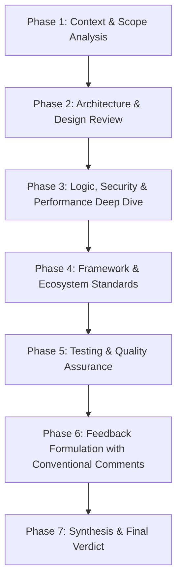

# Pull Request Review Best Practices (PR Review Skill)

This skill provides a standardized, step-by-step workflow to conduct high-quality, constructive, and thorough Pull Request (PR) code reviews. It ensures system stability, enforces engineering standards, and fosters a collaborative learning culture across the development team.

---

## 🎯 Core Review Philosophy

1. **Egoless & Code-Centric**: Critique the code, never the author. Maintain an empathetic, respectful, and constructive tone at all times.
2. **High Standards with Practical Balance**: Safeguard codebase quality without becoming a bottleneck. Distinguish between hard requirements and personal preferences (avoid bikeshedding).
3. **Explain the "Why" & Provide Concrete Solutions**: Every actionable comment (`fix`, `suggestion`) must explain *why* the change is necessary and include a concrete code snippet (`diff`) or implementation suggestion.
4. **Proactive Praise (`praise`)**: Actively acknowledge clever solutions, clean refactoring, elegant patterns, and thorough test coverage. Positive reinforcement builds team morale.

---

## 🔄 7-Phase Review Workflow

### Phase 1: Context & Scope Analysis
- Review the PR title, description, and linked issue/user story (Jira/GitHub Issue).
- Classify the change type: Feature, Bug Fix, Performance Optimization, Refactoring, Security Patch, or Chore.
- Evaluate the **Blast Radius**: Which modules, downstream consumers, or external services could be impacted?
- Check PR size: If the diff is excessively large (> 400 lines of meaningful logic), suggest breaking it into smaller, incremental PRs when feasible.

### Phase 2: Architecture & Design Review
- **Separation of Concerns**: Ensure clear boundaries between UI components, business logic (`@/services`, `@/hooks`), state management (`@/context`, Redux/Zustand), and data access layers (Prisma/APIs).
- **Code Reusability (DRY)**: Check whether existing utilities or shared UI components in `@/components` could be reused rather than re-implemented.
- **Extensibility & Maintainability**: Ensure the design is easy to modify and does not introduce tight coupling or brittle abstractions.

### Phase 3: Logic, Security & Performance Deep Dive
> 💡 *Use the comprehensive [PR Review Checklist](./references/checklist.md) for an exhaustive audit.*

- **Logic & Edge Cases**: Validate handling for empty arrays (`[]`), blank strings (`""`), `null`, `undefined`, boundary limits, off-by-one errors, and race conditions.
- **Security**:
  - Verify Authentication & Authorization (check for IDOR and privilege escalation).
  - Enforce Input Validation (e.g., Zod schemas) and protection against XSS and injection attacks.
  - Ensure zero hardcoded secrets, API tokens, or unintended client exposure via `NEXT_PUBLIC_` variables.
- **Performance**:
  - Prevent memory leaks (missing effect cleanup, uncancelled subscriptions/timers).
  - Avoid redundant re-renders (`useMemo`/`useCallback` used judiciously).
  - Check for N+1 query patterns in database and ORM operations (Prisma).

### Phase 4: Framework & Ecosystem Standards (React & Next.js)
- **Client vs Server Components (App Router)**: Keep components on the server by default; apply `'use client'` only when client-side interactivity, hooks, or browser APIs are required.
- **Data Fetching & State**: Leverage server-side data fetching where appropriate; implement robust loading indicators (Skeletons) and fallback states.
- **Accessibility (A11y) & SEO**: Use semantic HTML (`<button>`, `<main>`), proper `aria-label` tags for icon buttons, and appropriate metadata.
- **TypeScript Strictness**: Strictly avoid `any`; import shared types from `@/types/*`; enforce safe type narrowing.

### Phase 5: Testing & Quality Assurance
- Verify that unit or integration tests are included for new business logic, calculations, and bug fixes.
- Review test quality: Ensure mocks are clean, deterministic, and not over-mocked.
- Check edge-case test coverage (e.g., error responses, network timeouts, empty datasets).

### Phase 6: Feedback Formulation with Conventional Comments
> 💡 *Follow the conventions detailed in [Review Comment Guide](./references/review-comment-guide.md).*

Tag every review comment with standard Conventional Comments prefixes:
- `fix:` / `blocker:`: Critical bug, security flaw, or regression that must be resolved before merging.
- `suggestion:`: Actionable improvement for better readability, performance, or code hygiene.
- `question:`: Request for clarification on intent, context, or edge-case handling.
- `nit:`: Minor cosmetic or stylistic detail (non-blocking).
- `praise:`: Explicit recognition of excellent code or thoughtful design.

### Phase 7: Synthesis & Final Verdict
> 💡 *Use the [PR Review Summary Template](./references/template-summary.md) to generate a structured final report.*

Provide a clear executive summary and one of three final decisions:
1. **✅ Approve (LGTM)**: The code meets all engineering standards and is ready to merge.
2. **🟡 Approve with Minor Comments**: Ready to merge once minor non-blocking comments (`nit`, `suggestion`) are addressed.
3. **🔴 Request Changes**: Significant issues or blockers must be resolved before approval.

---

## 📚 References & Resources

- 📋 [PR Review Checklist](./references/checklist.md) - In-depth 8-pillar technical audit checklist.
- 💬 [Review Comment Guide & Etiquette](./references/review-comment-guide.md) - Conventional comments standards and communication best practices.
- 📝 [PR Review Summary Template](./references/template-summary.md) - Ready-to-use executive review report template.
